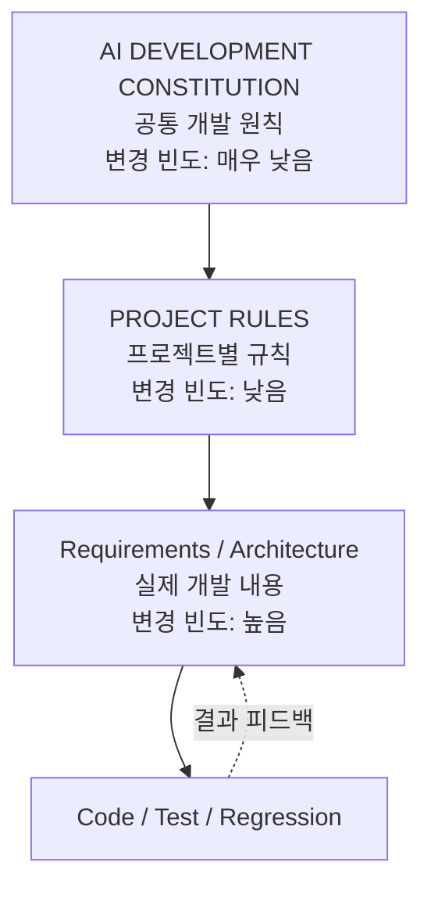
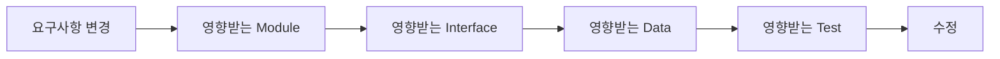

# 00_AI_DEVELOPMENT_CONSTITUTION.md

> **Document Version:** v0.1  
> **Status:** Draft / Living Document  
> **Purpose:** AI를 개발 보조자로 사용할 때, 프로젝트와 무관하게 항상 적용할 최상위 개발 원칙을 정의한다.  
> **Scope:** PassFail, Signal Export, 향후 Requirement Agent 및 기타 AI 보조 개발 프로젝트 공통

---

# 1. 문서의 목적

본 문서는 AI가 소프트웨어를 구현·수정할 때 따라야 하는 **공통 개발 원칙(Engineering Governance)** 을 정의한다.

이 문서는 개별 기능 요구사항을 복제하지 않는다.

- **Requirements.xlsx**는 “무엇을 만들어야 하는가(What)”를 정의한다.
- **AI DEVELOPMENT CONSTITUTION**은 “어떤 원칙으로 개발해야 하는가(How to work)”를 정의한다.
- **PROJECT_RULES.md**는 “이 프로젝트만의 규칙”을 정의한다.
- **ARCHITECTURE.md**는 “어디가 책임지고 어떻게 연결되는가”를 정의한다.
- **CODING_STANDARD.md**는 “코드를 어떤 규칙으로 작성·검사하는가”를 정의한다.

---

# 2. 권장 문서 구조

```text
Project_Root/
│
├─ 00_AI_DEVELOPMENT_CONSTITUTION.md
│    └─ 모든 프로젝트 공통 / 가장 잘 안 바뀜
│
├─ 01_PROJECT_RULES.md
│    └─ 프로젝트별 파일명, Package, 환경, 도구 규칙
│
├─ Requirements.xlsx
│    └─ 최신 승인 요구사항 / 기능·동작의 Single Source of Truth
│
├─ ARCHITECTURE.md
│    └─ 구조 / 모듈 책임 / Interface / 주요 실행 흐름
│
└─ CODING_STANDARD.md
     └─ 향후 확장: Coding Style / MISRA-C / METRIC / RTE / Static Analysis 등
```

## 문서 계층 개념



---

# 3. 문서별 권한 영역

| 문서 | 담당 질문 | 최종 기준이 되는 영역 |
|---|---|---|
| `Requirements.xlsx` | 무엇을 해야 하는가? | 기능, 사용자 동작, 입력/출력, 예외, 판정조건 |
| `00_AI_DEVELOPMENT_CONSTITUTION.md` | 어떤 원칙으로 개발해야 하는가? | 개발 절차, AI 행동 통제, 변경 원칙, 검증 원칙 |
| `01_PROJECT_RULES.md` | 이 프로젝트에서만 지켜야 하는 것은? | 날짜/Revision/Package, 환경, 프로젝트 고유 규칙 |
| `ARCHITECTURE.md` | 어디가 책임지고 어떻게 연결되는가? | 모듈 책임, Interface, Dependency, 실행 구조 |
| `CODING_STANDARD.md` | 코드를 어떤 방식으로 작성·검사하는가? | Coding Style, MISRA-C, Metric, RTE, Static Analysis |

---

# 4. 문서 충돌 처리 원칙

문서 간 충돌은 단순히 “한 문서가 항상 우선”으로 처리하지 않는다.  
먼저 **충돌한 내용이 어느 문서의 권한 영역인지 판단**한다.

## 4.1 우선 판단 기준

1. **사용자의 현재 명시적 지시**
2. **해당 내용의 권한을 가진 최신 승인 문서**
3. **기존 검증된 동작**
4. **기존 코드 / 주석 / 기타 참고문서**

## 4.2 기능 동작 충돌

기능 동작, 입력/출력, 판정조건, 예외 동작이 충돌하는 경우:

> **최신 승인된 `Requirements.xlsx`를 우선한다.**

기존 SW 동작과 Requirement가 다르더라도 기존 동작을 무조건 보존하지 않는다.

## 4.3 개발 원칙 충돌

개발 절차, AI 행동 범위, 최소 변경, 검증 방식 등 개발 원칙이 충돌하는 경우:

> **`00_AI_DEVELOPMENT_CONSTITUTION.md`를 우선한다.**

## 4.4 프로젝트 고유 규칙 충돌

파일명, Package Naming, 배포 구조, 특정 환경 설정 등 프로젝트 고유 사항은:

> **`01_PROJECT_RULES.md`를 우선한다.**

## 4.5 Architecture 충돌

모듈 책임, Interface, Dependency가 불일치하는 경우:

> `Requirements.xlsx`의 기능 의도를 우선 확인한 뒤  
> `ARCHITECTURE.md`를 수정하거나 영향 분석을 수행한다.

---

# 5. Requirement 준수 원칙

## 5.1 Requirements.xlsx는 기능 요구사항의 Single Source of Truth이다

AI는 구현 또는 수정 전에 최신 승인된 `Requirements.xlsx`를 우선 확인해야 한다.

개발 헌법은 Requirements의 세부 내용을 복제하지 않는다.

## 5.2 요구사항에 없는 기능을 임의로 추가하지 않는다

AI는 요구사항에 명시되지 않은 사용자 동작이나 기능을 임의로 추가하지 않는다.

불명확한 정보가 있는 경우 추정하여 구현하지 말고 다음 중 하나로 표시한다.

- `TBD`
- `Open Issue`
- `Assumption`

## 5.3 Assumption 관리

정보 부족으로 구현에 가정이 필요한 경우:

- 가정을 암묵적으로 코드에 반영하지 않는다.
- 어떤 가정을 했는지 명시한다.
- Requirement 또는 사용자 확인으로 확정되기 전까지 임시 가정으로 관리한다.

## 5.4 Requirement와 현행 동작이 다른 경우

AI는 다음과 같이 처리한다.

```text
Requirement
   ↓
Existing Behavior 확인
   ↓
차이점 식별
   ↓
의도된 차이인지 판단
   ↓
필요 시 사용자 확인 / 문서 갱신
```

기존 코드가 그렇게 동작한다는 이유만으로 요구사항을 추정하지 않는다.

---

# 6. 기존 기능 보존 원칙

신규 기능 추가 또는 수정 시, 변경 요구사항과 직접 관련 없는 기존 기능은 유지한다.

## 6.1 Minimal Change Principle

> 요청받은 변경보다 수정 범위를 불필요하게 넓히지 않는다.

리팩터링이 필요하더라도 기존 동작에 영향을 줄 가능성이 있다면 별도 변경사항으로 취급한다.

---

# 7. 변경 전 영향 분석

AI는 코드를 바로 수정하기 전에 다음 영향을 확인한다.



최소 확인 항목:

- 변경 Requirement
- 영향받는 Module
- 영향받는 Interface
- 관련 입력/출력
- 데이터 Format 영향
- 기존 기능 영향 가능성
- 필요한 Regression Test

---

# 8. Architecture 경계 보호

각 Module은 정의된 Responsibility를 준수해야 한다.

새 기능을 기존 Module에 추가하기 전에:

1. 해당 기능이 해당 Module의 책임 범위인지 확인한다.
2. 다른 Responsibility라면 별도 Module 분리를 검토한다.
3. 다른 Module의 내부 구현에 직접 의존하지 않는다.
4. 가능한 경우 정의된 Interface를 통해 접근한다.

Architecture의 구체적인 구조와 책임은 `ARCHITECTURE.md`에서 관리한다.

---

# 9. AI가 스스로 판단할 수 있는 범위

AI는 외부 동작에 영향을 주지 않는 내부 구현 세부사항에 한하여 자율적으로 판단할 수 있다.

## 9.1 AI가 비교적 자유롭게 판단 가능한 영역

- 단순한 내부 구현 방식
- 명백한 중복 코드 제거
- 외부 동작에 영향을 주지 않는 구조 정리
- 코드 가독성 개선

단, 기존 Interface, 데이터 Format, 외부 참조 식별자와 연결되어 있다면 임의 변경하지 않는다.

## 9.2 AI가 임의로 결정하면 안 되는 영역

- Requirement 변경
- 사용자 동작 변경
- 파일 Format 변경
- Interface 변경
- 기존 기능 삭제
- 외부 Dependency 추가
- 비가역적 데이터 변경
- 배포 방식 변경

---

# 10. 외부 Dependency 추가 원칙

새로운 외부 Library / Framework / Package 추가는 최소화한다.

추가 전 최소한 다음을 확인한다.

1. Python Standard Library 또는 기존 Dependency로 해결 가능한가?
2. 신규 Dependency가 반드시 필요한가?
3. 기존 배포 환경에서 사용 가능한가?
4. 유지보수에 불필요한 부담을 추가하지 않는가?

향후 필요 시 아래 항목을 추가 검토한다.

- License
- 보안 취약점
- 버전 고정 정책
- 장기 유지보수성

---

# 11. 파일 / 데이터 보호 원칙

원본 데이터와 사용자 데이터는 기본적으로 보호한다.

- 입력 원본 파일을 불필요하게 직접 수정하지 않는다.
- 삭제, 덮어쓰기, 비가역적 변경은 명시적으로 승인된 Requirement가 있는 경우에만 허용한다.
- 기존 파일을 대체해야 하는 요구사항이 없다면 별도 결과 파일을 생성하는 방식을 우선 검토한다.
- 데이터 변경 시 어떤 데이터가 변경되는지 추적 가능해야 한다.

---

# 12. 실패 / 예외 처리 원칙

예외를 무조건 무시하거나 숨기지 않는다.

실패 발생 시 가능한 범위에서 다음을 확인 가능하도록 한다.

- 무엇이 실패했는지
- 어떤 입력 또는 조건에서 실패했는지
- 실패 원인이 무엇인지
- 사용자가 어떤 조치를 취할 수 있는지

프로젝트별 구체적인 예외 동작은 `Requirements.xlsx`에서 정의한다.

---

# 13. 로그 원칙

주요 실행 단계와 실패 원인은 추적 가능해야 한다.

기본 로그 개념:

| Level | 의미 |
|---|---|
| `INFO` | 정상 진행 |
| `WARNING` | 예상과 다른 상태이나 진행 가능 |
| `ERROR` | 기능 수행 실패 |
| `DEBUG` | 개발 및 원인 분석용 상세 정보 |

구체적인 로그 메시지, 저장 위치, Format은 프로젝트 요구사항 또는 향후 `CODING_STANDARD.md`에서 정의한다.

---

# 14. 테스트 및 Regression 원칙

변경 후 최소한 다음을 수행한다.

1. 변경된 기능 Test
2. 관련 기존 기능 Regression Test
3. 실패 발생 시 원인 확인
4. 기존 동작 변경 여부 확인

> **“프로그램이 실행된다”와 “Requirement를 만족한다”를 동일하게 취급하지 않는다.**

구체적인 Test Case와 판정조건은 Requirements / Test 문서에서 관리한다.

---

# 15. Date / Revision / Package 원칙

각 프로젝트의 기존 Date / Revision / Package Naming Rule을 유지한다.

세부 Naming Rule은 `01_PROJECT_RULES.md`에서 관리한다.

예:

```text
Date
Revision
Package Sequence
```

이 세 가지는 서로 다른 개념으로 취급한다.

프로젝트별 규칙은 향후 필요가 확인되면 개정할 수 있다.

---

# 16. Requirements Traceability 원칙

가능한 경우 변경 내용은 대응하는 Requirement를 추적할 수 있어야 한다.

향후 확장 예:

```text
REQ-PF-001
    ↓
ARCH-PF-003
    ↓
src/module.py
    ↓
TC-PF-017
```

v0.1에서는 자동 Traceability 도구를 요구하지 않는다.

---

# 17. Definition of Done

AI가 “완료”라고 판단하기 전에 가능한 범위에서 다음을 확인한다.

- [ ] Requirement 반영
- [ ] Architecture 영향 확인
- [ ] 코드 구현 완료
- [ ] 변경 기능 Test 완료
- [ ] 관련 Regression Test 완료
- [ ] Error / Warning 확인
- [ ] 관련 문서 갱신
- [ ] Date / Version / Revision / Package 규칙 준수

프로젝트 특성에 따라 항목을 추가하거나 구체화할 수 있다.

---

# 18. 문서 중복 방지 원칙

동일한 구체 요구사항을 여러 문서에 복제하지 않는다.

## 좋은 예

**Constitution**

> 실패는 추적 가능해야 한다.

**Requirements.xlsx**

> DBC Load 실패 시 ERROR 상태를 기록하고, 실패한 파일명과 실패 원인을 사용자에게 표시한다.

## 나쁜 예

**Constitution**

> DBC Load 실패 시 오류창을 출력한다.

**Requirements.xlsx**

> DBC Load 실패 시 오류창을 출력한다.

동일 문장을 복제하면 향후 한쪽만 수정되어 충돌할 수 있으므로 피한다.

---

# 19. Living Document 원칙

본 문서는 완성된 고정 규칙집이 아니라 **Living Document**이다.

```text
v0.1
 ↓
PassFail 적용
 ↓
문제 발견
 ↓
v0.2
 ↓
Requirement Agent 적용
 ↓
문제 발견
 ↓
v0.3
```

실제 프로젝트 적용 결과에 따라 수정·확장한다.

---

# 20. 향후 확장 항목

아래 항목은 현재 v0.1의 필수 범위가 아니며, 필요 시 별도 문서 또는 후속 버전으로 확장한다.

- Coding Style
- Naming Convention
- MISRA-C
- Metric
- Runtime Error
- Static Analysis
- Code Review
- CI / CT / CD
- Security
- Dependency License 관리
- 자동 Traceability
- 자동 Regression
- AI Code Review
- AI Test Evaluation

---

# 21. 핵심 요약

```text
Requirements.xlsx
= 무엇을 만들어야 하는가
= 기능 요구사항의 Single Source of Truth

AI DEVELOPMENT CONSTITUTION
= 어떤 원칙으로 개발해야 하는가
= AI의 개발 행위 통제

PROJECT_RULES
= 이 프로젝트에서만 적용되는 규칙

ARCHITECTURE
= 어디가 책임지고 어떻게 연결되는가

CODING_STANDARD
= 코드를 어떤 방식으로 작성·검사하는가
```

## 최종 원칙

> **Requirement를 복제하지 않는다.**  
> **각 문서는 자신의 역할에 집중한다.**  
> **기능 충돌 시 Requirements를 우선한다.**  
> **개발 원칙 충돌 시 Constitution을 우선한다.**  
> **AI는 모르는 것을 추정하여 구현하지 않는다.**  
> **변경은 최소화하고, 영향과 Regression을 확인한다.**  
> **완벽한 문서보다 실제 프로젝트 적용을 통해 점진적으로 개선한다.**
